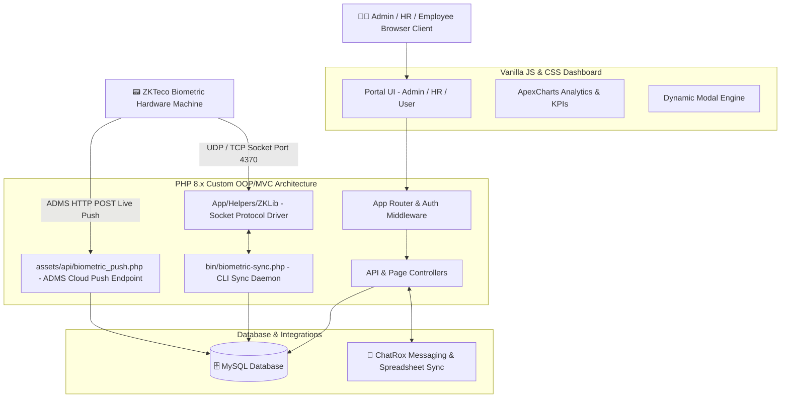
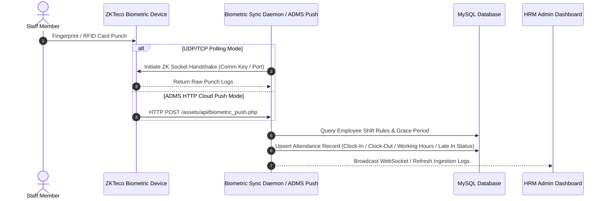

<div align="center">

  <!-- Header Banner / Hero -->
  <p align="center">
    
  </p>

  <!-- Status & Tech Badges -->
  <p align="center">
    <a href="https://github.com/akamaanullah/hrm-v2"></a>
    <a href="https://www.php.net/"></a>
    <a href="https://www.zkteco.com/"></a>
    <a href="https://github.com/akamaanullah/chtrox"></a>
    <a href="https://www.mysql.com/"></a>
    <a href="https://amaanullah.com"></a>
  </p>

  <p align="center">
    <strong>A high-performance enterprise Human Resource Management (HRM), Payroll Processing, and ZKTeco Biometric Attendance Portal built with Custom PHP OOP/MVC.</strong>
  </p>

  <!-- Quick Portfolio & Case Study Links -->
  <p align="center">
    <a href="https://amaanullah.com/projects/hrm-employee-management-payroll-portal"></a>
    <a href="https://amaanullah.com/projects/chatrox-real-time-messaging-professional-networking"></a>
    <a href="https://github.com/akamaanullah/chtrox"></a>
    <a href="https://amaanullah.com"></a>
  </p>

</div>

<br/>

---

## 📌 Table of Contents

<div align="center">

  <p align="center">
    <a href="#-whats-new-in-version-25"></a>
    <a href="#-system-architecture--visual-diagrams"></a>
    <a href="#-core-features--modules-breakdown"></a>
  </p>
  <p align="center">
    <a href="#-tech-stack--libraries"></a>
    <a href="#-repository-directory-structure"></a>
    <a href="#-installation--local-setup"></a>
    <a href="#-developer--contact-info"></a>
  </p>

</div>

<br/>

---

## ⚡ What's New in Version 2.5

- 📟 **Dynamic ZKTeco Biometric Machine Integration**: No developer required! Configure, test, sync, or disconnect any ZKTeco biometric attendance machine (K60/ID series) live from the Admin GUI.
- 📡 **Dual Protocol Sync Engine (UDP/TCP + ADMS Cloud Push)**: Supports both direct IP socket communication via `ZKLib` and live HTTP push events from ADMS/iclock hardware webservers.
- 💬 **ChatRox Workspace Connected App**: Centralized third-party integrations dashboard allowing self-hosted ChatRox configuration via Domain or custom IP & Port.
- ⏱️ **Grace Period & Smart Late-In Engine**: Shift-aware attendance evaluation logic (e.g. 8:00 AM shift with 15-minute grace marks `08:15:00` as ON TIME; `08:16:00` triggers LATE IN).
- 📊 **Interactive KPI Management & Template System**: Build evaluation templates, score employees, generate KPI reports, and visualize performance benchmarks.
- 💰 **Automated Payroll Engine & Printable Payslips**: Process monthly payroll cycles, compute earnings, allowances, and tax deductions, and print professional employee payslips.
- 📢 **Broadcast Announcements & Event Calendar**: Organization-wide communication hub for HR announcements, notifications, and scheduled events.
- 🔒 **Role-Based Access Governance (RBAC)**: Strict role-separated portals for Admin, HR, Managers, and Employees with session validation.

<div align="right"><a href="#-table-of-contents"></a></div>

---

## 🏗️ System Architecture & Visual Diagrams

### High-Level Architecture Overview



### Attendance Ingestion & Biometric Processing Flow



<div align="right"><a href="#-table-of-contents"></a></div>

---

## 🚀 Core Features & Modules Breakdown

| Module | Description | Key Tech | Case Study Link |
| :--- | :--- | :--- | :--- |
| **Dynamic Biometric Integration** | GUI configuration for ZKTeco devices with live socket testing, auto-sync daemon, and ADMS HTTP push URL. | `PHP OOP` `ZKLib` `Sockets` | [](https://amaanullah.com/projects/hrm-employee-management-payroll-portal) |
| **ChatRox Connected App** | Integrated spreadsheet sharing and messaging link between HRM and ChatRox workspace. | `PHP API` `REST` `JSON` | [](https://amaanullah.com/projects/chatrox-real-time-messaging-professional-networking) |
| **Attendance & Grace Period Engine** | Automatic Shift matching, grace period calculation, late-in flags, and working hours calculation. | `MySQL` `PHP DateTime` | [](https://amaanullah.com/projects/hrm-employee-management-payroll-portal) |
| **KPI & Performance Management** | KPI templates creation, department evaluation forms, employee rating matrices, and progress reporting. | `ApexCharts` `JS` `PHP` | [](https://amaanullah.com/projects/hrm-employee-management-payroll-portal) |
| **Payroll Cycle & Payslip Printing** | Monthly salary calculations, tax/allowance adjustments, approval workflow, and printable PDF/HTML payslips. | `PHP DOM` `CSS Print` | [](https://amaanullah.com/projects/hrm-employee-management-payroll-portal) |
| **Recruitment & Applicant Funnel** | Job posting management, applicant tracking system (ATS), candidate evaluation, and onboarding queue. | `PHP MVC` `File Uploads` | [](https://amaanullah.com/projects/hrm-employee-management-payroll-portal) |

<div align="right"><a href="#-table-of-contents"></a></div>

---

## 🧰 Tech Stack & Libraries

<div align="center">

  
  
  
  
  
  
  
  
  

</div>

<br/>

* **Primary Stack**: PHP 8.x (Custom OOP MVC) • MySQL 5.7+ / MariaDB
* **Biometric Driver**: `App/Helpers/ZKLib.php` (UDP/TCP binary socket protocol driver for ZKTeco devices)
* **Frontend UI**: Vanilla HTML5 • ES6 JavaScript • Vanilla CSS3 Design Tokens • Lucide Icons • ApexCharts
* **Connected Integrations**: ChatRox Real-Time Workspace Messaging • ZKTeco ADMS HTTP Web Push

<div align="right"><a href="#-table-of-contents"></a></div>

---

## 📁 Repository Directory Structure

```
hrm-6-8-26/
├── app/                        # Core Application Backend (MVC)
│   ├── Controllers/            # Route Handlers & Controllers
│   ├── Core/                   # Router, Database, View Renderer, Auth
│   ├── Helpers/                # ZKLib Driver, Date & Calculation Helpers
│   ├── Middleware/             # Role & Session Authorization
│   └── Models/                 # Database Query Models
├── bin/                        # CLI Scripts & Background Daemons
│   ├── biometric-sync.php      # Dynamic Biometric Machine Sync Engine
│   └── test-zk.php             # Live Machine Socket Diagnostic Tool
├── config/                     # Application & Environment Configurations
│   └── config.php              # Global Database & App Settings
├── database/                   # Database Schemas & Migrations
│   └── new-hrm-schema.sql      # Database Schema & Structure
├── public/                     # Public Web Root & Assets
│   ├── assets/
│   │   ├── api/                # Connected Apps & Push Receivers
│   │   │   ├── biometric_push.php   # ADMS HTTP Web Push Endpoint
│   │   │   └── connected_apps_api.php # Connected Apps Controller
│   │   ├── css/                # Stylesheets
│   │   ├── images/             # System Logos (ZKTeco, Chatrox, User Avatars)
│   │   └── js/                 # Client Scripts (KPIs, Attendance, Dashboards)
│   └── index.php               # Application Entrypoint
├── storage/                    # Logs, Uploads, & Cache
├── uploads/                    # Employee Profiles, Resumes, ID Cards
└── views/                      # View Templates
    ├── admin/                  # Admin Management Pages & Connected Apps
    ├── hr/                     # HR Operations Views
    ├── partials/               # Shared Headers, Footers, & Sidebars
    └── user/                   # Employee Portal Pages
```

<div align="right"><a href="#-table-of-contents"></a></div>

---

## 📦 Installation & Local Setup

### 1. Prerequisites
* Web Server (Apache with `mod_rewrite` enabled or Nginx)
* PHP 8.0 or higher (with `pdo_mysql`, `sockets` extensions enabled)
* MySQL 5.7+ or MariaDB 10.3+
* Composer

### 2. Environment Configuration
Clone the repository and set up environment variables:
```bash
git clone https://github.com/akamaanullah/hrm-v2.git
cd hrm-v2
cp .env.example .env
```

Update your `.env` file:
```env
DB_HOST=127.0.0.1
DB_NAME=hrm
DB_USER=root
DB_PASS=your_password
BASE_URL=http://localhost/hrm-6-8-26
```

### 3. Database Setup
1. Create a database named `hrm`.
2. Import the database schema from `database/new-hrm-schema.sql`.

### 4. Install Dependencies
```bash
composer install
```

### 5. Biometric Machine Connection Setup
1. Open Admin Portal -> **Settings** -> **Connected Apps**.
2. Click **Configure** on the **Attandance Machine** card.
3. Enter your ZKTeco device IP (e.g. `192.168.1.200`), socket port (`4370`), and Comm Key.
4. Click **Test Connection** to verify socket communication.
5. (Optional) Run the background sync daemon:
   ```bash
   php bin/biometric-sync.php --daemon --interval 10
   ```

<div align="right"><a href="#-table-of-contents"></a></div>

---

## 🌐 SEO & Software Engineering Services by Amaanullah

HRM Portal is engineered by **[Amaanullah](https://amaanullah.com)** as part of an enterprise Web & Systems Architecture showcase, specializing in:
* **Human Resource & Enterprise Systems**: Custom HRM, Payroll automation, Shift scheduling, and Biometric device integration.
* **Real-time Hardware & Software Integrations**: ZKTeco socket protocol drivers, ADMS HTTP Push receivers, and WebSockets.
* **Full-Stack Application Development**: High-performance PHP MVC platforms, Custom Dashboards, and RESTful APIs.

For technical consulting, custom software development, or enterprise solution implementation, visit **[amaanullah.com](https://amaanullah.com)**.

---

## 👨‍💻 Developer & Contact Info

* **Developer Name**: Amaanullah
* **Official Website**: [https://amaanullah.com](https://amaanullah.com)
* **Primary Email**: [akamaanullah@gmail.com](mailto:akamaanullah@gmail.com)
* **Official Contact Email**: [info@amaanullah.com](mailto:info@amaanullah.com)
* **GitHub Profile**: [github.com/akamaanullah](https://github.com/akamaanullah)

---

## 📄 License
This project is released under the **MIT License**.
